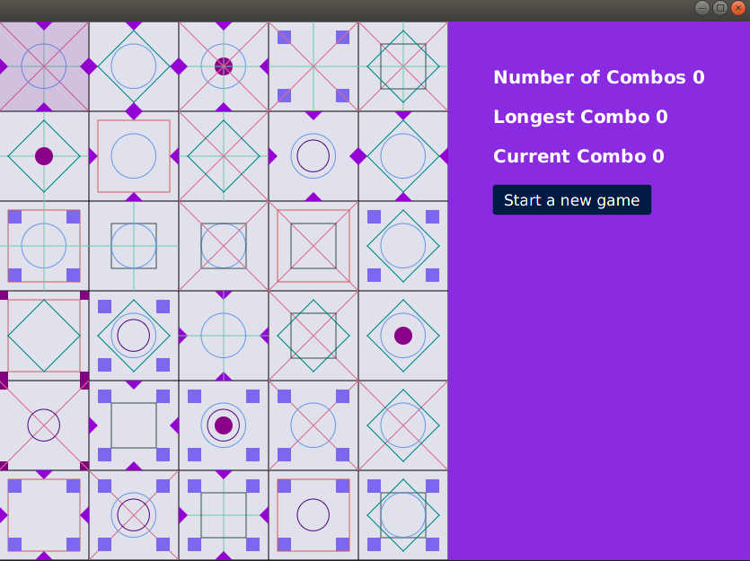
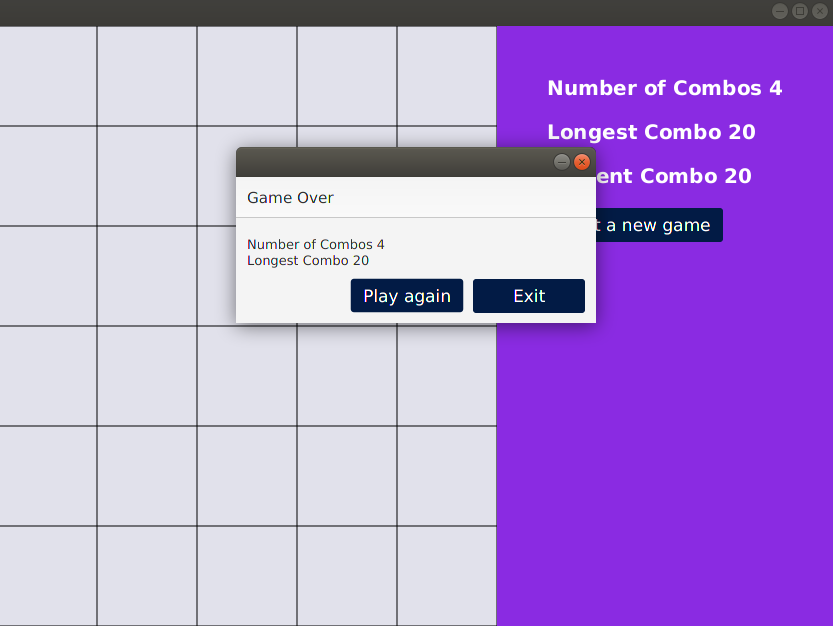

Tiles Game
===

*This idea and the rules of the game is taken from the NY Times puzzle game.*  
*Visit [NY Times puzzle game](https://www.nytimes.com/puzzles/tiles) to check out their version of the game*

---

**How to play**
* Select two tiles to remove shared elements.
* The tiles do not have to be adjacent.
* Elements must be the same shape and color to be removed.
* The second tile you select will become your new first tile. Try to continue this combo until the whole board is cleared.
* If you end your move on an empty tile, you can start again from any tile without losing your combo.

---

**Game Features**
* Each tile contains at least three geometric shapes. Same shapes always have same colors.
* Longest combo, current combo, total number of combos used so far is diplayed at the right.
* Clicking the button "Start a new game" you can reset the board and start a new game.
* Once all the tiles are empty, the game notifies you about the total combos taken and longest combo.
* After the game is over you will get a dialog box with the above mentioned information and two buttons with the options to either restart or exit.
* Simple geometric figures and color combination have been used in the game so that the board is comfortable to the eye, yet not too easy to find a match.

---

